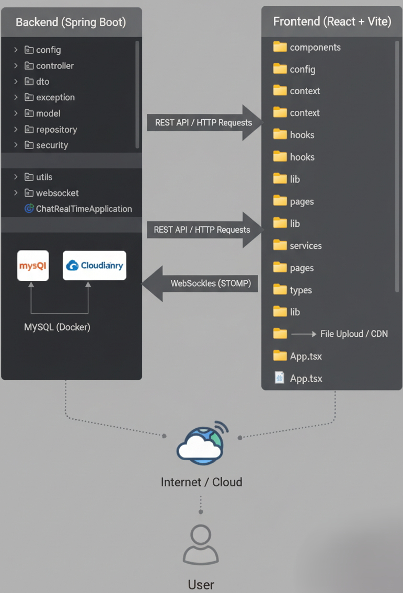
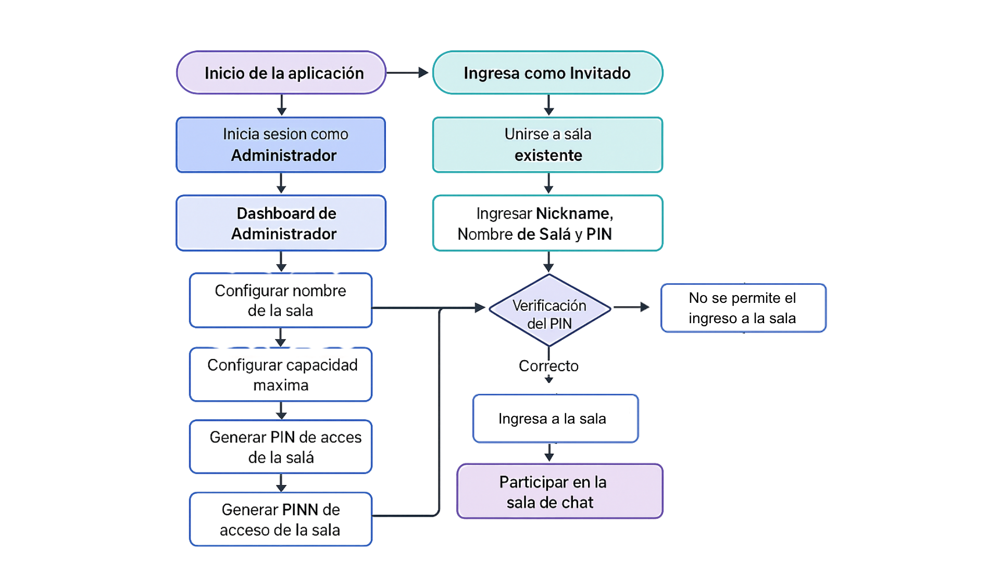
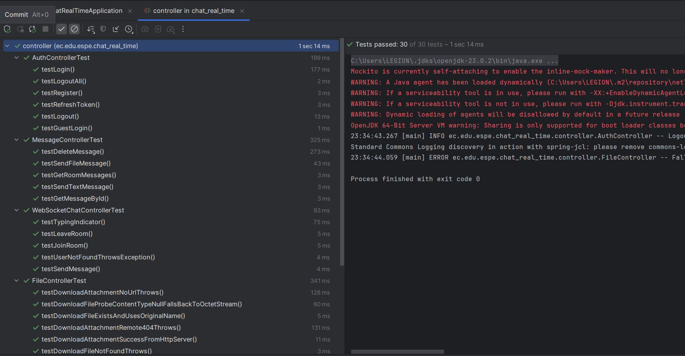
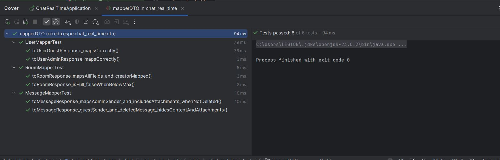
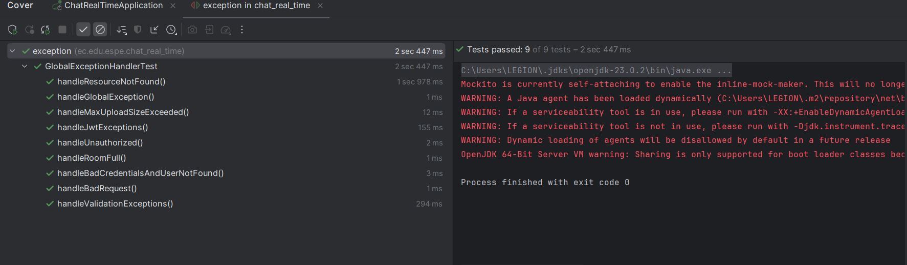
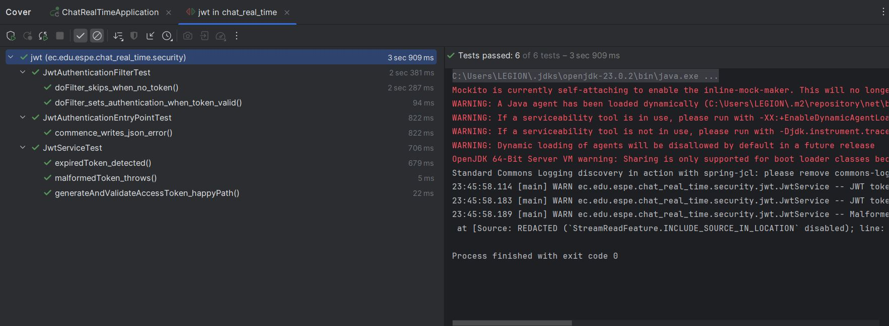
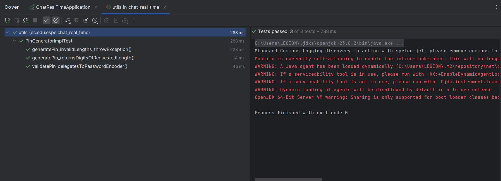
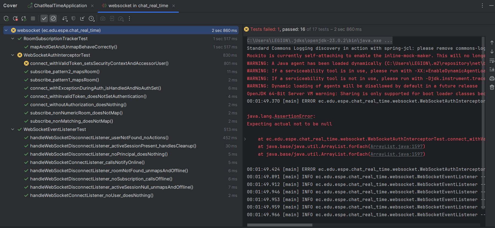
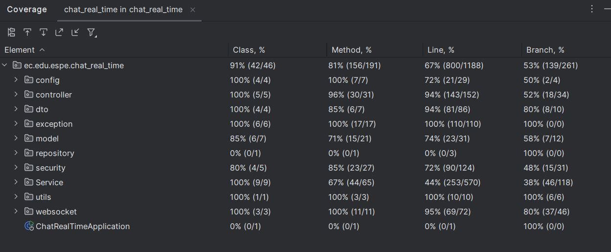

# Sistema de Chat en Tiempo Real con Salas Seguras

Este proyecto implementa un sistema de chat en tiempo real con salas seguras, desarrollado como parte del Proyecto Integrador del Parcial I de la materia **Aplicaciones Distribuidas**. El sistema permite comunicación instantánea mediante **WebSockets**, salas protegidas con **PIN**, gestión de archivos en salas multimedia y un flujo de interacción administrado por un backend robusto en **Spring Boot**.

---

Este proyecto fue elaborado por Alejandro Andrade, Jairo Bonilla, Axel Herrera y Micaela Salcedo.

## Objetivos

**General:**  
Desarrollar un sistema de chat seguro y en tiempo real, con salas administradas mediante PIN, utilizando tecnologías distribuidas.

<details>
<summary><b><i style="font-size:20px;">Objetivos Específicos:</i></b></summary>


* Implementar autenticación del administrador.
* Permitir la creación de salas con ID único y PIN.
* Integrar mensajería bidireccional con WebSockets.
* Habilitar salas multimedia para subir archivos.
* Asegurar concurrencia mediante hilos.
* Garantizar sesión única por dispositivo.
* Ofrecer un frontend responsivo y funcional.

</details>

---

<details>
<summary><b><i style="font-size:18px;">Arquitectura</i></b></summary>



</details>

---

## Metodología

<details>
<summary><b><i style="font-size:18px;">Lenguaje y herramientas:</i></b></summary>
  - Spring Boot y MySQL  
  - Docker  
  - Cuenta en Cloudinary (para subir archivos multimedia)
</details>
<details>
<summary><b><i style="font-size:18px;">Requisitos del Sistema</i></b></summary>

Asegúrate de tener instalado el siguiente software:

* **JDK 21** o superior  
* **Node.js 18+** o superior  
* **Maven 3.9+** o superior  
* **Git**  
* **MySQL 8** (o utilizar la opción recomendada de Docker)  
* **Cuenta en Cloudinary**

</details>

--- 


<details>
<summary><b><i style="font-size:18px;">Ejecución del Proyecto Backend</i></b></summary>

## Base de Datos con Docker (RECOMENDADO)

La manera más sencilla de levantar la base de datos MySQL es utilizando Docker.

## 1. Clonar el Repositorio

```bash
https://github.com/JairoBonilla2004/Chat-Real-TIme.git

```

## 2. Iniciar el Contenedor
Ejecuta el siguiente comando en tu terminal para crear e iniciar el contenedor de la base de datos:

```bash
docker run -d --name mysql-chat -p 3306:3306 -e MYSQL_ROOT_PASSWORD=root123 -e MYSQL_DATABASE=chat_real -e MYSQL_USER=jairo -e MYSQL_PASSWORD=jairo123 --restart=always mysql:8.0 --default-authentication-plugin=mysql_native_password
```
Si el contenedor ya existe, puedes iniciarlo simplemente con: docker start mysql-chat

## 3. Configuración de Conexión
Verifica que el archivo **backend/src/main/resources/application.properties** contenga la configuración de la base de datos:

```
spring.datasource.url=jdbc:mysql://localhost:3306/chat_real
spring.datasource.username=jairo
spring.datasource.password=jairo123
spring.jpa.hibernate.ddl-auto=update

CLOUDINARY_CLOUD_NAME= Colorar tu CLOUD_NAME
CLOUDINARY_API_KEY= coloca tu apy key
CLOUDINARY_API_SECRET=coloca tu apu secret

```

## 4. Ejecutar el Servidor
Desde la carpeta raíz del proyecto **(/chat-real-time)**, navega a la carpeta del backend y ejecuta:

```bash
cd backend
mvn spring-boot:run
```
El backend estará disponible en **http://localhost:8080**.

## 5. Ejecutar el Servidor
Desde la carpeta raíz del proyecto **(/chat-real-time)**, navega a la carpeta del backend y ejecuta:

```bash
cd backend
mvn spring-boot:run
```
El backend estará disponible en **http://localhost:8080**.
</details>

--- 
<details>
<summary><b><i style="font-size:18px;">Ejecución del Proyecto Frontend</i></b></summary>

## 1. Clonar el Repositorio
Abre una nueva terminal (manteniendo el backend en ejecución) y navega a la carpeta del frontend.
```bash
cd frontend
npm install
```
## 1. Iniciar la Aplicación

```bash
npm run dev
```

El backend estará disponible en **http://localhost:3000**.
</details>

---

## 🚀 Cómo funciona la aplicación

Esta aplicación está diseñada para facilitar la comunicación instantánea en salas virtuales con distintos niveles de acceso y funcionalidades. A continuación, se detalla el flujo de uso.

---

<details>
<summary><i style="font-size:16px;"> Roles de Usuario</i></summary>

El sistema distingue entre dos roles principales para gestionar el acceso y la funcionalidad de las salas:

| Rol | Descripción | Permisos |
|-----|-------------|----------|
| **Administrador** | Usuario registrado y autenticado. | Crear, Ver y Gestionar salas. |
| **Invitado** | Usuario no registrado que accede a una sala. | Unirse a salas existentes (solo necesita la URL y/o PIN). |

</details>

<details>
<summary><i style="font-size:16px;">Acceso y Autenticación</i></summary>

- **Registro:** Para obtener el rol de Administrador, el primer paso es registrarse en la plataforma.
- **Inicio de Sesión:** Una vez registrado, inicia sesión utilizando tu nombre de usuario y contraseña para acceder a las funcionalidades de gestión.

</details>

<details>
<summary><i style="font-size:16px;">Creación de Salas (Solo Administradores)</i></summary>

Como Administrador, puedes crear una sala configurando las siguientes características:

**Tipo de Sala:**

- **Multimedia:** Permite a los participantes subir archivos multimedia (imágenes, videos, etc.) además de enviar texto.
- **Solo Texto:** Solo permite el envío de mensajes de texto.

**Nombre de la Sala:**  
Un nombre descriptivo para identificar la reunión.

**Capacidad:**  
El número máximo de personas que pueden unirse a la sala.

**Límite de Carga (Solo Multimedia):**  
El máximo de megabytes (MB) que se permite subir en los archivos multimedia.

</details>

<details>
<summary><i style="font-size:16px;">PIN de Acceso</i></summary>

Una vez creada la sala, el sistema te proporcionará un **PIN de Sala**. Este PIN es la clave de acceso que debes compartir con los Invitados.

> 📝 Nota: Si olvidas el PIN de una sala, el sistema te ofrece la opción de restablecerlo por uno nuevo.

</details>

<details>
<summary><i style="font-size:16px;">Ingreso como Invitado</i></summary>

Para unirte a una sala como Invitado, no necesitas registrarte, pero debes proporcionar la información de la sala:

- **Nickname:** Un apodo obligatorio que será visible para todos los participantes de la sala.  
- **Nombre de la Sala:** El nombre exacto de la sala.  
- **PIN de Acceso:** El código secreto que debe ser proporcionado por el Administrador de la sala.

</details>

<details>
<summary><i style="font-size:16px;">Cosas a Tener en Cuenta</i></summary>

- **Sesión Volátil:** La sala de chat funciona de manera similar a una reunión de Google Meet:  
  Si recargas la página o cierras la pestaña, saldrás de la sala y tendrás que volver a ingresar con el PIN y el Nickname.
- **Límite de Dispositivos:** Solo se permite ingresar a una reunión por dispositivo a la vez. No puedes unirte a dos salas o a la misma sala dos veces desde el mismo navegador o dispositivo.

</details>
---
<details>
<summary><b><i style="font-size:18px;">Flujo del Programa</i></b></summary>



</details>

---

<details>
<summary><b><i style="font-size:18px;">Pruebas Unitarias</i></b></summary>

Este apartado resume las pruebas unitarias realizadas en el proyecto, agrupadas por responsabilidad. Cada prueba valida el correcto comportamiento de una unidad concreta del sistema.

- **Controller:**: Pruebas que verifican las rutas y respuestas del controlador, validan códigos HTTP y manejo de entradas/salidas.

  

- **DTO (Data Transfer Objects):**: Pruebas que aseguran la correcta transformación y validación de datos entre capas.

   

- **Exception:**: Pruebas para garantizar que las excepciones se manejan correctamente y que el sistema responde con mensajes y códigos adecuados.

  

- **Model:**: Pruebas que validan las entidades del dominio, sus getters/setters y reglas básicas de negocio asociadas.

  

- **Repository:**: Pruebas que comprueban las operaciones de acceso a datos (consultas, persistencia y eliminación).

  

- **Security:**: Pruebas relacionadas con autenticación, autorización y manejo de tokens/credenciales.

  

- **Service:**: Pruebas de la lógica de negocio en servicios, asegurando que las operaciones compuestas funcionan correctamente.

  

- **Utils:**: Pruebas para utilidades y helpers, validando funciones auxiliares reutilizables.

  

- **WebSocket:**: Pruebas que validan el comportamiento de la comunicación en tiempo real vía WebSocket (envío/recepción de mensajes, suscripción a salas).

  

</details>

---

<details>
<summary><b><i style="font-size:18px;">Cobertura</i></b></summary>

La sección de cobertura muestra el porcentaje e informe visual obtenido tras ejecutar las pruebas unitarias. A continuación se incluye la captura del reporte de cobertura generado para el módulo backend.



</details>
